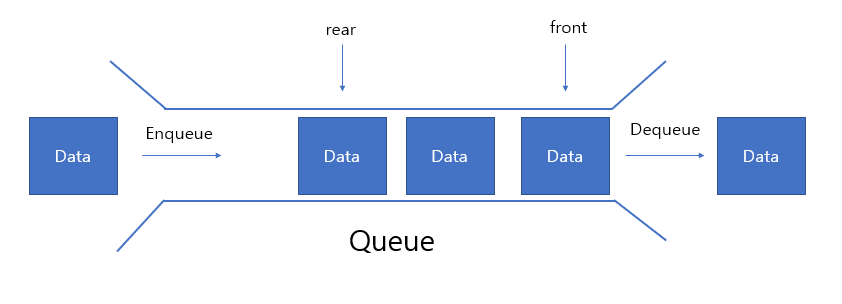
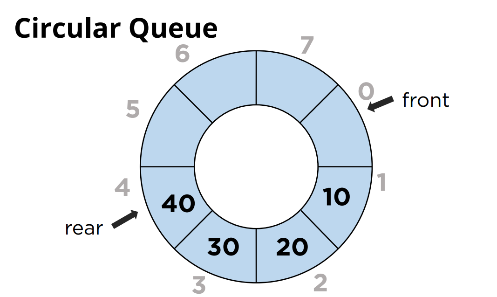

# 큐
| 큐는 선형 자료구조로, 선입선출(FIFO, First In First Out)의 원리로 동작합니다. 즉 먼저 들어온 데이터는 먼저 나가는 구조입니다.

## 큐의 구성 요소
- 데이터(Elements) - 큐에 저장되는 요소입니다.
- 프론트(Front) - 큐의 시작을 가리키는 포인터입니다, 첫 번째 요소 바로 앞의 인덱스를 가집니다.
- 리어(Rear) - 큐의 끝을 가리키는 포인터입니다.

## 큐의 연산
- enqueue - 원소를 추가
- dequeue - 마지막 원소를 삭제
- peek - 가장 앞 원소를 확인(삭제 x)
- size - 큐의 사이즈 확인
- isFull or isEmpty - 큐가 꽉 찼는지, 비었는지 확인
- 큐를 순회하는 데 걸리는  

## 선형 큐와 원형 큐
### 1. 선형 큐
- 선형큐는 배열을 이용하여 구현된 큐로, 데이터를 넣고(enqueue) 뺄 때(dequeue) 각각의 끝에서만 작업이 가능합니다.
- 한번 자료가 들어갔다가 빠진 곳은 더이상 자료가 들어갈 수 없으므로 메모리가 낭비됩니다.
### 2. 원형 큐
- 원형큐는 선형큐의 문제점을 해결하기 위해 개발된 자료구조로, 배열을 원형으로 사용하여 데이터를 순환하면서 저장하는 방식입니다.
- 선형 큐와 다르게 배열을 순회하면서 넣기 때문에 공간 활용을 효율적으로 할 수 있습니다.
- 프론트(Front)와 리어(rear)를 계산할 때 큐의 길이로 나머지(mod)연산을 해주어야합니다. (e.g. 원형큐의 길이가 5인 경우, (4 + 1) % 5), 큐의 길이를 오버할 수 있기 때문입니다.

